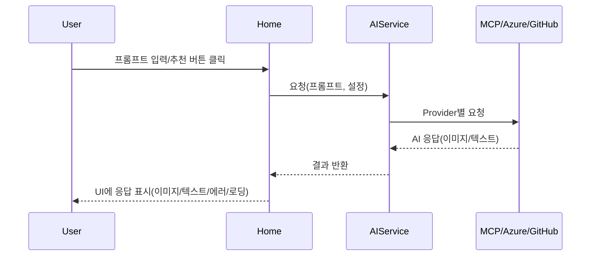

# 설계 문서 (Design Specification)

## 1. 아키텍처 개요
- **구성요소:**
  - Home.razor: AI 인터페이스, 프롬프트 입력, 추천 버튼, 응답 표시, 대화 히스토리, 로딩/에러, 이미지/텍스트 구분
  - Settings.razor: 토큰/엔드포인트 입력, 저장/상태 표시, UX/보안
  - NavMenu.razor: 네비게이션 구조, Settings 추가, AI 브랜딩
  - IAIService/AIService: AI Provider 통합, MCP/Azure/GitHub 모델 지원, 이미지/텍스트 응답 처리
  - IConfigurationService: 안전한 설정 저장/로드, 환경별 처리, User Secrets/암호화
  - MCP/Azure/GitHub 클라이언트: 각 Provider별 통합 및 오류 처리

## 2. 데이터 흐름


## 3. 인터페이스 및 API 계약
- IAIService
  - `Task<AIResponse> SendPromptAsync(string prompt)`
  - Provider 우선순위: Azure OpenAI > GitHub Models > MCP
  - 이미지/텍스트 응답 구분, 에러/재시도 처리
- IConfigurationService
  - `Task SaveSettingsAsync(SettingsModel settings)`
  - `Task<SettingsModel> LoadSettingsAsync()`
  - User Secrets/암호화/환경별 처리

## 4. 데이터 모델
```csharp
public class SettingsModel {
    public string HuggingFaceToken { get; set; }
    public string ModelName { get; set; } = "gpt-4.1-mini";
    public string GitHubModelToken { get; set; }
    public string AzureOpenAIEndpoint { get; set; }
    public string AzureOpenAIApiKey { get; set; }
    public string McpServerEndpoint { get; set; } = "https://huggingface.co/mcp";
}

public class AIResponse {
    public string Text { get; set; }
    public List<string> ImageUrls { get; set; }
    public bool IsError { get; set; }
    public string ErrorMessage { get; set; }
}
```

## 5. 에러 처리 및 보안 설계
| 상황                        | 처리 방식                                  |
|-----------------------------|--------------------------------------------|
| Provider 미설정             | 설정 안내 메시지, "No configured AI provider" 방지 |
| 네트워크/토큰 오류          | 에러 메시지, 재시도 버튼                   |
| 이미지 로딩 실패            | 에러 메시지, 재시도 옵션                   |
| 민감 정보 저장              | User Secrets(개발), 암호화(운영), 로그 미출력 |
| Rate Limit/응답 오류        | 사용자 안내, 재시도/대체 Provider 사용      |

## 6. 테스트 전략
- IAIService: Provider별 정상/오류/우선순위/재시도 단위 테스트
- Settings.razor: 입력/저장/상태 표시/UX 테스트
- Home.razor: 프롬프트/추천/응답/이미지/텍스트/에러/로딩 UI 테스트
- MCP/Azure/GitHub 클라이언트: 통합/오류/도구 패널 테스트
- 설정/보안: User Secrets/암호화/환경별 테스트

---

> 본 문서는 `requirements.md`를 기반으로 작성된 설계 초안입니다.
