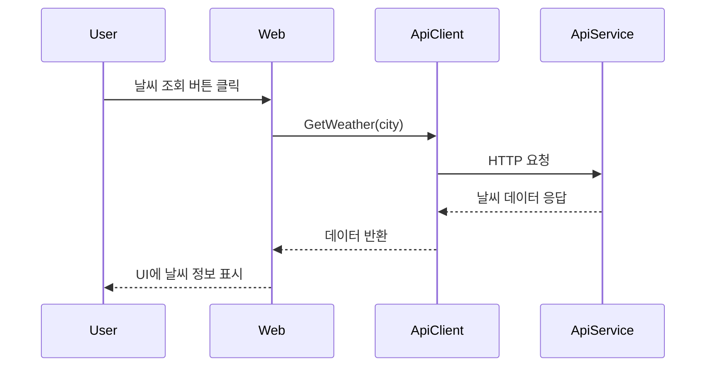

# 설계 문서 (Design Specification)

## 1. 아키텍처 개요
- **구성요소:**
  - WebApp.Web: 사용자 인터페이스, Razor Components
  - WebApp.ApiService: 외부/내부 API 데이터 제공
  - WebApp.ServiceDefaults: 공통 서비스 확장 및 설정
  - WebApp.AppHost: 앱 실행 및 환경 관리

- **상호작용:**
  - 사용자는 WebApp.Web에서 날씨 정보를 조회
  - WebApp.Web은 WeatherApiClient를 통해 ApiService에 요청
  - ApiService는 실시간 날씨 데이터를 반환

## 2. 데이터 흐름


## 3. 인터페이스 및 API 계약
- WeatherApiClient
  - `Task<WeatherInfo> GetWeatherAsync(string city)`
  - 오류 발생 시 예외 처리 및 재시도 지원
- ApiService
  - RESTful 엔드포인트 `/weather?city={city}`
  - JSON 응답: `{ "city": "Seoul", "temp": 28, "desc": "Clear" }`

## 4. 데이터 모델
```csharp
public class WeatherInfo {
    public string City { get; set; }
    public double Temp { get; set; }
    public string Desc { get; set; }
}
```

## 5. 에러 처리 및 예외 시나리오
| 상황                | 처리 방식                |
|---------------------|-------------------------|
| API 응답 없음       | 네트워크 오류 메시지 표시, 재시도 버튼 제공 |
| 데이터 파싱 실패    | "데이터 오류" 메시지 표시 |
| 로딩 지연           | 로딩 인디케이터 표시      |

## 6. 유닛 테스트 전략
- WeatherApiClient: 정상/오류/재시도 케이스별 단위 테스트
- Weather.razor: UI 렌더링, 에러/로딩 상태 테스트
- ApiService: Mock 데이터 기반 API 응답 테스트

---

> 본 문서는 `requirements.md`를 기반으로 작성된 설계 초안입니다.
